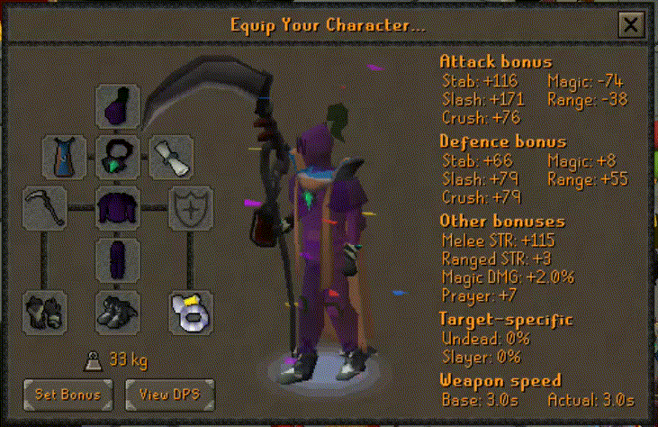

## an-osrs-project

I'm probably bankstanding on W420 rn. This service outputs the value of 
my current equipped gear.

Only tradeable items/item components included. 

See armor [here](https://oldschool.runescape.wiki/w/Christmas_corrupt_cluefest). 

### Install

#### Prereqs:
* Python3.8+
* python-pip

From an-osrs-project dir: `pip install -r requirements.txt`

### Run
* From an-osrs-project dir: `uvicorn app:app`
* API listens at localhost:8000, docs automatically generated at localhost:8000/docs